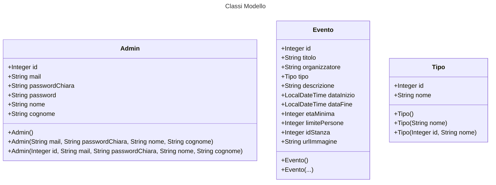
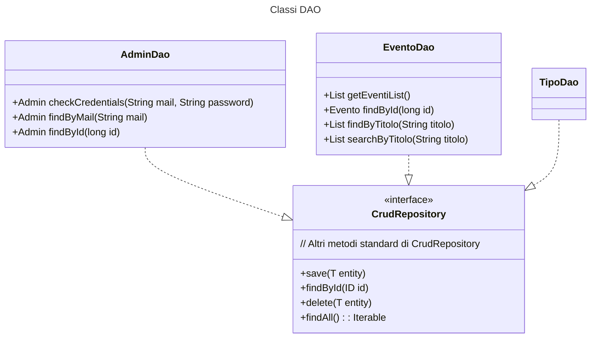

# UFS15 - Museo  

**Autori**: Francesco Lanza, Giulia Andreea Banica, Francesco Mazzi, Dario Chin, Jacopo Grassi, Federico Giacomantonio.

### Traccia

**Eventi e Mostre**: si devono gestire gli Eventi e delle Mostre, dovrà essere creata una Agenda degli eventi, pianificare mostre e assegnare gli spazi all’interno del Museo per tali eventi.

### Documentazione
Puoi trovare la documentazione a [questo link](https://docs.google.com/document/d/1e8Pf7fWnh56HrLVpSJQD9qpKgVbrsqYC/edit?usp=sharing&ouid=105135503871678567263&rtpof=true&sd=true).

## Funzionalità
Con questo sistema l'utente è in grado di:
- Fare login come amministratore,
- Creare nuovi amministratori,
- Eliminare amministratori,
- Modificare amministratori,
- Creare nuovi eventi,
- Eliminare eventi,
- Modificare eventi.

### Sicurezza
Il sistema prevede controlli dei dati a livello back-end e un sistema di hashing utilizzando sha256 per crittare le password degli amministratori.

### Interfaccia Utente
L'interfaccia utente è realizzata con semplicissimo html e css, collegati tra di loro tramite ThymeLeaf.

## Classi MVC

```mermaid
---
title: Classi Controller
---

classDiagram
    class AdminController {
        +AdminController()
        +String redirectToDashBoard()
        +String adminDashboard(HttpSession session, Model model)
        +String gestisciUtenti(Model model, HttpSession session)
        +String eliminaUtente(long id, HttpSession session)
        +String creaAdmin(Model model, HttpSession session)
        +String postCreaAdmin(@Valid Admin a, BindingResult bindingResult, Model model, HttpSession session)
        +String modificaAdmin(long id, Model model, HttpSession session)
    }

    class EventoDao {
        <<interface>>
    }
    
    class TipoDao {
        <<interface>>
    }
    
    class AdminDao {
        <<interface>>
    }

    class HttpSession {
    }

    class Model {
    }

    class BindingResult {
    }

    AdminController --> EventoDao : uses
    AdminController --> TipoDao : uses
    AdminController --> AdminDao : uses
    AdminController --> HttpSession : uses
    AdminController --> Model : uses
    AdminController --> BindingResult : uses

    class AdminController {
        +String redirectToDashBoard()
        +String adminDashboard(HttpSession session, Model model)
        +String gestisciUtenti(Model model, HttpSession session)
        +String eliminaUtente(long id, HttpSession session)
        +String creaAdmin(Model model, HttpSession session)
        +String postCreaAdmin(@Valid Admin a, BindingResult bindingResult, Model model, HttpSession session)
        +String modificaAdmin(long id, Model model, HttpSession session)
    }
    
    class EventiController {
        +String eventi(String searchTerm, Model model, HttpSession session)
        +String cercaEventi(String s, Model model, HttpSession session)
        +String eliminaEvento(long id, HttpSession session)
        +String modificaEvento(long id, Model model, HttpSession session)
        +String aggiornaEvento(@Valid Evento e, BindingResult bindingResult, Model model, HttpSession session)
        +String evento(Model model, HttpSession session)
    }
    
    class HomeController {
        +String homeRedirect(Model model)
        +String infoEvento(long id, Model model)
        +String elencoEventi(Model model)
        +String elencoMostre(Model model)
    }
    
    class LoginController {
        +String postLoginPage(Model model, HttpSession session)
        +String postLogin(@Valid Admin admin, BindingResult bindingResult, HttpSession session)
        +String postLogout(HttpSession session)
    }

    class EventoDao {
        <<interface>>
    }

    class TipoDao {
        <<interface>>
    }

    class AdminDao {
        <<interface>>
    }

    class HttpSession {
    }

    class Model {
    }

    class BindingResult {
    }

    AdminController --> AdminDao : uses
    AdminController --> EventoDao : uses
    AdminController --> TipoDao : uses
    AdminController --> HttpSession : uses
    AdminController --> Model : uses
    AdminController --> BindingResult : uses

    EventiController --> EventoDao : uses
    EventiController --> TipoDao : uses
    EventiController --> HttpSession : uses
    EventiController --> Model : uses
    EventiController --> BindingResult : uses

    HomeController --> EventoDao : uses
    HomeController --> TipoDao : uses
    HomeController --> Model : uses

    LoginController --> AdminDao : uses
    LoginController --> HttpSession : uses
    LoginController --> Model : uses
    LoginController --> BindingResult : uses
```

## Riflessioni
Grazie a questo sistema, si possono creare nuovi tipi tramite un `@Bean`, oppure inserendoli manualmente nel DB.
Ciò consente una maggiore flessibilità e scalabilità del sistema.

### Criticità
Purtroppo il nostro sistema non prevede molto controllo dei dati a lato front-end con javascript, il che puo’ comportare problemi di sicurezza e di performance da parte del back-end.