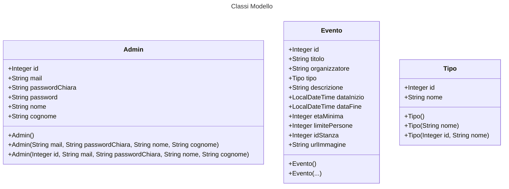
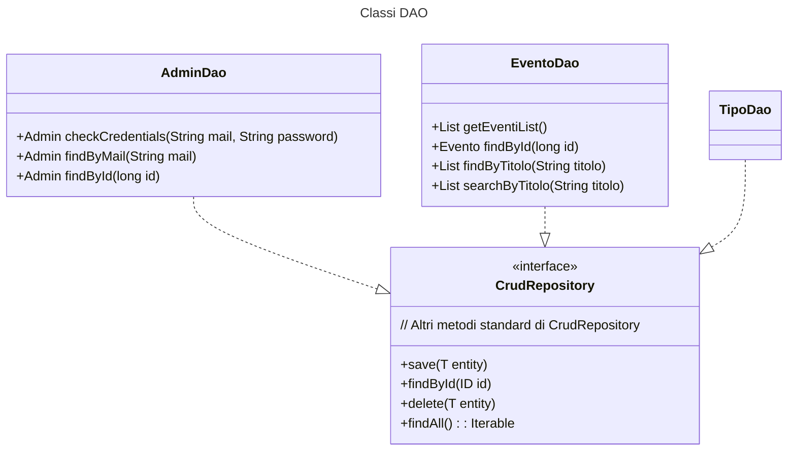

# UFS15

**Autori**: Francesco Lanza, Giulia Andreea Banica, Francesco Mazzi, Dario Chin, Jacopo Grassi, Federico Giacomantonio.

### Traccia

**Eventi e Mostre**: si devono gestire gli Eventi e delle Mostre, dovrà essere creata una Agenda degli eventi, pianificare mostre e assegnare gli spazi all’interno del Museo per tali eventi.

## Classi MVC

